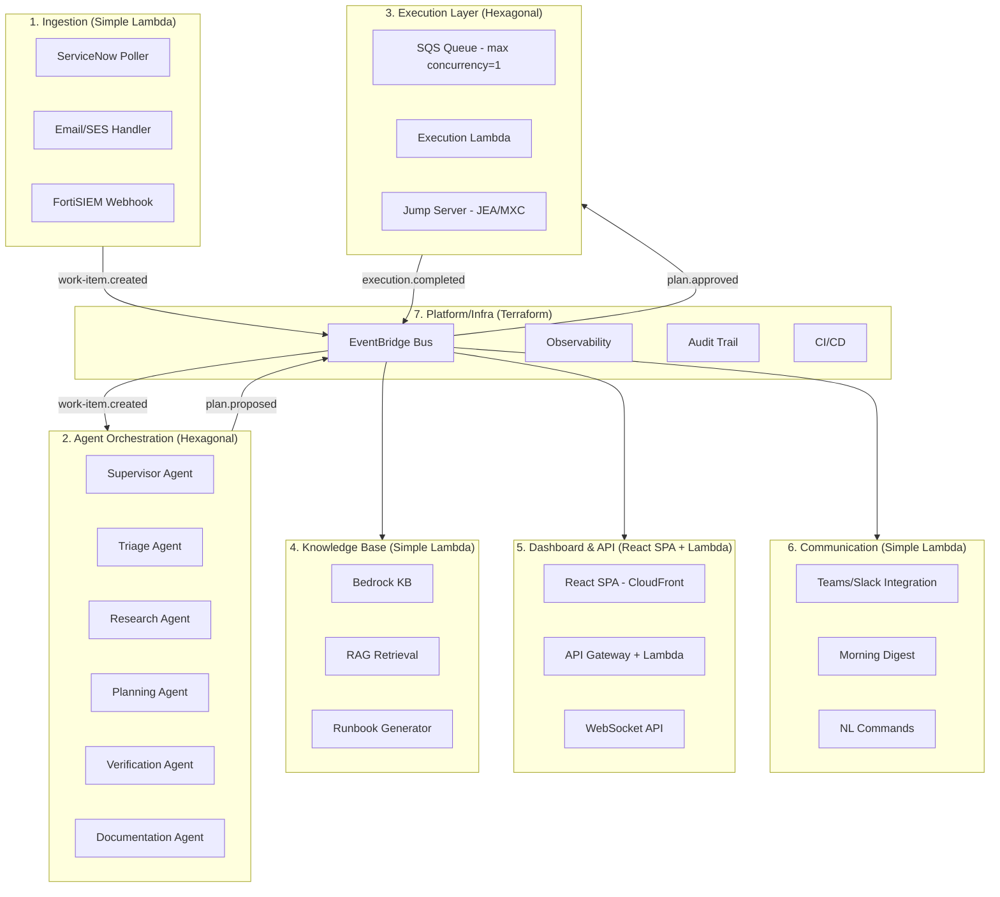

# Design Document: ForgeAdmin Platform

## Overview

ForgeAdmin is an agentic multi-agent Windows SysAdmin platform for the ODOT Windows Server team. It ingests incidents from ServiceNow, email, and FortiSIEM alerts, then orchestrates specialized agents (Triage, Research, Planning, Execution, Verification, Documentation) to research, plan, execute, and document resolutions. The platform operates on a progressive autonomy model — starting in shadow mode and advancing to autonomous execution as confidence grows.

The system is decomposed into 7 independently deployable bounded contexts communicating via Amazon EventBridge events. Each context owns its data, deploys via its own Terraform state, and can be destroyed/redeployed independently. The platform runs entirely serverless on AWS (zero EC2 instances) with sandboxed execution on a hardened on-prem Windows jump server connected via Transit Gateway.

### Key Design Goals

- **Independent deployability**: Each bounded context operates, deploys, and fails independently
- **Event-driven communication**: All inter-context communication flows through EventBridge (no direct Lambda-to-Lambda calls)
- **Progressive autonomy**: Modules advance from shadow → supervised → autonomous via configurable promotion strategies
- **Halt-always-on-failure**: Any execution step failure halts the entire plan immediately
- **Full auditability**: Append-only audit trail with 365+ day retention
- **POC teardown**: `force_destroy = true` on all stateful resources; full account wipe/rebuild capability

---

## Architecture

### Bounded Context Decomposition

The platform consists of 7 bounded contexts, each with its own internal architecture pattern:



### Event Backbone

Amazon EventBridge custom bus (`forgeadmin-events`) serves as the central nervous system:

- **Event Envelope Standard**: Each event carries `source`, `detail-type`, `correlationId`, `version`, `timestamp`, and `payload`
- **SQS Buffering**: Execution Layer (max concurrency=1 for safety) and Communication (rate limit isolation for Teams/Slack APIs)
- **JSON Schema Contracts**: Stored in EventBridge Schema Registry and `contracts/events/{context}/{event}.schema.json`
- **Dead Letter Queues**: Every SQS queue has a DLQ; Platform context monitors DLQ depth

### Event Catalog

| Event | Source | Consumers |
|-------|--------|-----------|
| `work-item.created` | Ingestion | Orchestration |
| `triage.completed` | Orchestration | Dashboard |
| `plan.proposed` | Orchestration | Dashboard, Communication |
| `plan.approved` | Dashboard | Execution |
| `plan.rejected` | Dashboard | Orchestration, Communication |
| `execution.completed` | Execution | Orchestration, Knowledge Base, Dashboard |
| `execution.failed` | Execution | Orchestration, Communication, Dashboard |
| `verification.completed` | Orchestration | Knowledge Base, Dashboard |
| `work-item.resolved` | Orchestration (Documentation Agent) | Knowledge Base, Communication, Dashboard |
| `runbook.generated` | Knowledge Base | Communication, Dashboard |
| `module.state-changed` | Dashboard | Orchestration, Communication |
| `approval.decision` | Dashboard, Communication | Orchestration |
| `circuit-breaker.tripped` | Platform | Communication, Dashboard, Orchestration |
| `skill.updated` | Dashboard | Communication, Platform (audit) |
| `steering.updated` | Dashboard | Communication, Platform (audit) |

### Terraform Layer Architecture

```
terraform/
├── foundation/              # Shared infra (deployed first, destroyed last)
│   ├── eventbridge.tf       # Custom event bus, schema registry
│   ├── networking.tf        # VPC, Transit Gateway attachments
│   ├── iam-shared.tf        # Cross-context IAM roles
│   ├── cognito.tf           # User pool (shared auth)
│   └── outputs.tf           # SSM parameters for context discovery
├── contexts/
│   ├── ingestion/           # Own state file
│   ├── orchestration/       # Own state file
│   ├── execution/           # Own state file
│   ├── knowledge-base/      # Own state file
│   ├── dashboard/           # Own state file
│   ├── communication/       # Own state file
│   └── platform/            # Own state file
├── scripts/
│   ├── deploy-all.sh
│   ├── destroy-all.sh
│   └── destroy-context.sh
└── environments/
    ├── dev.tfvars
    └── staging.tfvars
```

**Independence Rules:**
- Each context uses separate S3 backend key: `forgeadmin/{context}/terraform.tfstate`
- Contexts discover shared resources via SSM Parameter Store (not hardcoded ARNs)
- Foundation outputs EventBridge bus ARN, VPC ID, Cognito pool ID to SSM
- `force_destroy = true` on all stateful resources for POC teardown

---

## Components and Interfaces

### 1. Ingestion Context (Simple Lambda)

**Responsibility**: Pull incidents from ServiceNow, email (SES), FortiSIEM; normalize into common work item format; publish `work-item.created` events.

**Components:**
- `ServiceNowPoller` — Scheduled Lambda polling ServiceNow API for new incidents
- `SESHandler` — Lambda triggered by SES rule for emails to `servers@dot.ohio.gov`
- `FortiSIEMWebhook` — API Gateway endpoint receiving FortiSIEM alert webhooks
- `WorkItemNormalizer` — Shared module normalizing all sources into common format
- `DeduplicationChecker` — DynamoDB lookup preventing duplicate ingestion

**Interfaces:**
```typescript
interface WorkItem {
  workItemId: string;           // Generated UUID
  sourceSystem: 'servicenow' | 'email' | 'fortisiem';
  originalId: string;           // Original ticket/alert ID
  createdAt: string;            // ISO-8601 timestamp
  severity: 'critical' | 'high' | 'medium' | 'low';
  shortDescription: string;
  fullDescription: string;
  metadata: Record<string, unknown>;  // Source-specific fields
}
```

### 2. Agent Orchestration Context (Hexagonal)

**Responsibility**: Supervisor pattern coordinating Triage, Research, Planning, Verification, and Documentation agents. AWS Step Functions orchestrates the multi-agent flow.

**Internal Structure (Hexagonal):**
```
contexts/orchestration/
├── domain/
│   ├── agents/           # Pure business logic
│   │   ├── supervisor.ts
│   │   ├── triage.ts
│   │   ├── research.ts
│   │   ├── planning.ts
│   │   ├── verification.ts
│   │   └── documentation.ts
│   ├── models/           # Domain entities
│   └── ports/            # Interfaces
│       ├── IKnowledgeBase.ts
│       ├── IEventPublisher.ts
│       ├── IModelInvoker.ts
│       ├── IServiceNowClient.ts
│       ├── ISkillSteeringProvider.ts
│       └── IStateStore.ts
├── adapters/             # AWS implementations
│   ├── bedrock-model.ts
│   ├── eventbridge-publisher.ts
│   ├── dynamodb-state.ts
│   ├── servicenow-client.ts
│   ├── knowledge-base-client.ts
│   └── skill-steering-provider.ts
└── handlers/             # Lambda entry points (thin wiring)
```

**Key Ports:**
```typescript
interface IModelInvoker {
  invoke(prompt: string, config: ModelConfig): Promise<ModelResponse>;
}

interface ISkillSteeringProvider {
  getComposedPromptContext(agentName: string): Promise<PromptContext>;
}

interface IKnowledgeBase {
  query(category: string, keywords: string[]): Promise<KnowledgeItem[]>;
}

interface IEventPublisher {
  publish(event: DomainEvent): Promise<void>;
}

interface IStateStore {
  getWorkItem(id: string): Promise<WorkItem>;
  saveWorkItem(item: WorkItem): Promise<void>;
  savePlan(plan: ExecutionPlan): Promise<void>;
}
```

**Step Functions Flow:**
1. Triage → 2. Research → 3. Planning → 3a. Confidence Check (if < 30: immediate escalation to human operator; "within 5 minutes" is max SLA, not a delay) → 4. Approval Gate (wait for callback) → 5. Execution (delegate) → 6. Verification → 7. Documentation (ServiceNow update + KB trigger + publish `work-item.resolved`)

**Sensitive Data Handling:**

When the Orchestration context processes work items containing sensitive data:
1. The shared `redaction.ts` module scans input before any LLM invocation
2. Detected sensitive data (credentials, PII, secrets) is replaced with redaction placeholders
3. IF redaction renders the data unusable for resolution (e.g., the incident IS about a specific credential), the work item is escalated to a human operator immediately — no LLM processing occurs. The full unredacted context is preserved on-prem (jump server access only) for the human operator.

**WebSocket Real-Time Updates:**

The Dashboard WebSocket API implements connection resilience:
- Server sends heartbeat ping every 30 seconds
- Client implements automatic reconnection with exponential backoff (1s, 2s, 4s, 8s, max 30s)
- On reconnection, client fetches full state snapshot to recover missed events
- Dashboard displays a "last updated" staleness indicator; if > 5 seconds stale, shows a warning badge
- Connection state is tracked in Zustand store for UI awareness

### 3. Execution Layer (Hexagonal + On-Prem Bridge)

**Responsibility**: Bridge AWS to on-prem jump server; JEA/MXC sandbox; single-concurrency execution; rollback management.

**Architecture:**
```
AWS: SQS (max concurrency=1) → Lambda → HTTPS (mTLS) via Transit Gateway → Jump Server
On-Prem: REST API → JEA endpoints → MXC Sandbox → Callback to API Gateway
```

**Key Interfaces:**
```typescript
interface IExecutionBridge {
  submitCommand(command: ExecutionCommand): Promise<ExecutionTicket>;
  getStatus(ticket: ExecutionTicket): Promise<ExecutionStatus>;
}

interface ExecutionCommand {
  planId: string;
  stepIndex: number;
  command: string;
  expectedOutcome: string;
  rollbackCommand?: string;
  timeout: number;  // Max 10 minutes
}
```

**Design Decisions:**
- Single concurrency via SQS (one execution at a time on jump server)
- Callback pattern: Jump server calls back to API Gateway when done (Lambda stays short-lived)
- mTLS certificates in Secrets Manager, auto-rotated
- 10-minute timeout: no callback = marked failed
- Halt-always-on-failure: any step failure halts entire plan

### 4. Knowledge Base Context (Simple Lambda)

**Responsibility**: Bedrock KB management; RAG retrieval; runbook generation; knowledge gap tracking.

**Components:**
- `KBQueryHandler` — Lambda handling research queries via Bedrock KB
- `RunbookGenerator` — Lambda generating structured runbooks from resolution data
- `KBUpdater` — Lambda updating KB with new resolution data
- `GapTracker` — DynamoDB tracking identified knowledge gaps

**Interfaces:**
```typescript
interface KnowledgeItem {
  id: string;
  title: string;
  category: string;
  content: string;
  relevanceScore: number;  // 0.0 - 1.0
  lastUpdated: string;
}

interface Runbook {
  id: string;
  title: string;
  applicableIncidentTypes: string[];
  prerequisites: string[];
  steps: RunbookStep[];
  expectedOutcomes: string[];
  rollbackSteps: string[];
}
```

### 5. Dashboard & API Context (React SPA + Lambda)

**Responsibility**: Module management, approval workflows, metrics visualization, RBAC enforcement.

**Frontend:**
- React SPA (TypeScript, Vite) on S3 + CloudFront
- Zustand for state management
- WebSocket API for real-time updates
- Types auto-generated from OpenAPI 3.1 spec

**Backend:**
- API Gateway REST → Lambda (TypeScript)
- OpenAPI 3.1 as single source of truth
- Cognito JWT validation at API Gateway authorizer
- RBAC: `team_lead` (full access: approvals, module configuration, skill addition) and `team_member` (approvals, audit trail viewing, read-only module configuration)

**Key API Endpoints:**
```
GET    /modules                    # List all modules with state
PATCH  /modules/:id/state          # Toggle module state
GET    /modules/:id/metrics        # Module metrics + confidence trends
GET    /approvals/pending          # Pending approval queue
POST   /approvals/:id/decision     # Approve/reject
GET    /executions                 # Execution history (filterable)
GET    /audit                      # Audit trail (filterable)
PATCH  /modules/:id/config         # Update thresholds/promotion strategy
GET    /skills                     # List all skills (filterable)
POST   /skills                     # Create skill (team_lead only)
GET    /skills/:id                 # Get skill with current content
PUT    /skills/:id                 # Update skill (new version)
DELETE /skills/:id                 # Soft-delete skill
POST   /skills/:id/rollback/:ver  # Rollback to version
GET    /steering                   # List all steering docs
POST   /steering                   # Create steering doc (team_lead only)
GET    /steering/:id               # Get steering doc
PUT    /steering/:id               # Update steering doc (new version)
DELETE /steering/:id               # Soft-delete steering doc
POST   /steering/:id/rollback/:ver # Rollback to version
GET    /agents/:name/token-budget  # Token budget per agent (skills/steering consumption)
```

**Key Interfaces:**
```typescript
interface ModuleConfig {
  moduleId: string;
  state: 'enabled' | 'disabled' | 'disabling' | 'shadow';
  confidenceThreshold: number;       // 0-100 inclusive
  promotionStrategy: 'manual' | 'auto-suggest';  // Mutually exclusive
  evaluationWindow: number;          // 7-90 days
  accuracyThreshold: number;         // 0-100 percentage for auto-suggest promotion
  slaPeriod: number;                 // 5-1440 minutes for approval timeout
  approverChain: string[];           // Escalation order
}

interface TokenBudgetResponse {
  agentName: string;
  modelContextWindow: number;        // Total tokens available
  basePromptTokens: number;          // Reserved for base prompt
  runtimeContextTokens: number;      // Estimated runtime context
  skillsSteeringTokens: number;      // Current skills/steering consumption
  availableTokens: number;           // Remaining budget
  documents: TokenBudgetDocument[];  // Per-document breakdown
}

interface TokenBudgetDocument {
  id: string;
  type: 'skill' | 'steering';
  scope: 'global' | string;         // 'global' or agent name
  title: string;
  tokenCount: number;
  priority: number;                  // Lower = higher priority (dropped last)
  wouldBeTruncated: boolean;         // True if over budget
}
```

### 6. Communication Context (Simple Lambda)

**Responsibility**: Teams/Slack notifications, morning digest, natural language interaction, notification retry/escalation, identity mapping.

**Components:**
- `NotificationDispatcher` — Routes events to Teams/Slack with retry logic
- `MorningDigestGenerator` — Scheduled Lambda (7:00 AM ET) compiling digest
- `NLCommandHandler` — Processes natural language commands from chat
- `EscalationHandler` — Handles notification failures and alternative delivery
- `IdentityMapper` — Maps Teams/Slack user IDs to Cognito roles for NL command authorization

**Notification Escalation Architecture:**

The Communication context implements a three-tier escalation ladder for notification delivery:

1. **Primary**: Teams/Slack webhook delivery (target: within 30 seconds of event)
2. **Secondary**: SES email delivery (triggered when 30/60-second timing is violated or Teams/Slack delivery fails after 3 retries with exponential backoff)
3. **Tertiary**: Dashboard alert via `notification.failed` event published to EventBridge (triggered when both Teams/Slack and email delivery fail)

Each escalation tier logs the failure in the audit trail. The Dashboard subscribes to `notification.failed` events and displays undelivered notifications in a persistent alert banner.

**Identity Mapping for NL Commands:**

The NL command handler authenticates users via a DynamoDB identity mapping table:

```typescript
interface IdentityMapping {
  teamsSlackUserId: string;    // PK: Teams/Slack user identifier
  cognitoUserId: string;       // Mapped Cognito user ID
  role: 'team_lead' | 'team_member';  // Cached role for fast authorization
  displayName: string;         // Human-readable name for audit trail
  lastVerified: string;        // ISO-8601 timestamp of last role sync
}
```

Before executing any write command (approve, reject, toggle module state), the NL handler:
1. Looks up the Teams/Slack user ID in the mapping table
2. Verifies the user's Cognito role authorizes the requested action
3. Rejects unauthorized requests with a helpful error message
4. Attributes the action to the mapped Cognito identity in the audit trail

The mapping table is managed by team leads via the Dashboard (manual entry) or synchronized from Cognito user pool attributes.

### 7. Platform/Infra Context (Terraform)

**Responsibility**: Foundation infrastructure, observability, audit trail, CI/CD.

**Shared Infrastructure:**
- EventBridge custom bus + Schema Registry
- VPC + Transit Gateway attachments
- Cognito User Pool
- CloudWatch Dashboards (per-context + platform overview)
- Audit trail DynamoDB table + S3 archival
- GitHub Actions CI/CD pipeline

---

## Data Models

### DynamoDB Single-Table Design (Per Context)

Each bounded context owns its own DynamoDB table with a single-table design using GSIs for access patterns.

### Ingestion Context Table

| Attribute | Type | Description |
|-----------|------|-------------|
| PK | `WORK_ITEM#{workItemId}` | Partition key |
| SK | `META` | Sort key |
| sourceSystem | String | servicenow, email, fortisiem |
| originalId | String | Source ticket/alert ID |
| createdAt | String (ISO-8601) | Ingestion timestamp |
| severity | String | critical, high, medium, low |
| shortDescription | String | Brief description |
| fullDescription | String | Full body/description |
| status | String | ingested, processing, resolved |
| ttl | Number | 90-day expiry epoch |

**GSI-1**: `sourceSystem-originalId-index` (deduplication lookup)

### Orchestration Context Table

| Attribute | Type | Description |
|-----------|------|-------------|
| PK | `WORK_ITEM#{workItemId}` | Partition key |
| SK | `TRIAGE` / `RESEARCH` / `PLAN#{planId}` / `VERIFICATION` | Sort key |
| category | String | Triage classification |
| riskLevel | String | low, medium, high |
| urgency | String | critical, high, normal, low |
| confidenceScore | Number | 0-100 |
| planSteps | List | Ordered execution steps |
| justification | String | Reasoning chain |
| knowledgeItems | List | Referenced KB items |
| status | String | pending, approved, executing, verified, failed |
| ttl | Number | 90-day expiry |

**GSI-1**: `status-createdAt-index` (pending items by time)
**GSI-2**: `category-riskLevel-index` (filtering by classification)

### Execution Context Table

| Attribute | Type | Description |
|-----------|------|-------------|
| PK | `EXECUTION#{executionId}` | Partition key |
| SK | `STEP#{stepIndex}` / `META` | Sort key |
| planId | String | Originating plan |
| command | String | Executed command |
| expectedOutcome | String | What should happen |
| actualOutcome | String | What did happen |
| exitCode | Number | Command exit code |
| startedAt | String | Step start time |
| completedAt | String | Step end time |
| verdict | String | pass, fail, timeout |
| ttl | Number | 90-day expiry |

**GSI-1**: `planId-index` (all steps for a plan)

### Dashboard Context Table (Module Config & Approvals)

| Attribute | Type | Description |
|-----------|------|-------------|
| PK | `MODULE#{moduleId}` / `APPROVAL#{approvalId}` | Partition key |
| SK | `CONFIG` / `HISTORY#{timestamp}` / `META` | Sort key |
| state | String | enabled, disabled, disabling, shadow |
| confidenceThreshold | Number | 0-100 |
| promotionStrategy | String | manual, auto-suggest |
| evaluationWindow | Number | 7-90 days |
| accuracyMetrics | Map | Ratio of correct/total proposals |
| approverChain | List | Escalation order |
| slaPeriod | Number | Minutes (5-1440) |

**GSI-1**: `state-index` (modules by operational state)
**GSI-2**: `approval-status-index` (pending approvals)

### Dashboard Context Table (Skills & Steering Index)

| Attribute | Type | Description |
|-----------|------|-------------|
| PK | `SKILL#{skillId}` / `STEERING#{steeringId}` | Partition key |
| SK | `META` / `VERSION#{version}` | Sort key |
| type | String | `skill` or `steering` |
| scope | String | `global` or `agent:{agentName}` |
| targetAgent | String | Agent name (null for global) |
| title | String | Human-readable name |
| description | String | Brief summary |
| s3Key | String | Current version S3 key |
| currentVersion | Number | Latest version number |
| createdBy | String | Team lead identity |
| createdAt | String | ISO-8601 |
| updatedAt | String | ISO-8601 |
| enabled | Boolean | Active or disabled |

**GSI-1**: `scope-type-index` (all docs by scope and type)
**GSI-2**: `targetAgent-type-index` (all docs for a given agent)

### Communication Context Table (Notification State + Identity Mapping)

| Attribute | Type | Description |
|-----------|------|-------------|
| PK | `NOTIFICATION#{notificationId}` / `IDENTITY#{teamsSlackUserId}` | Partition key |
| SK | `META` / `ATTEMPT#{attemptNumber}` | Sort key |
| type | String | `notification` or `identity_mapping` |
| cognitoUserId | String | Mapped Cognito user (identity records) |
| role | String | `team_lead` or `team_member` (cached) |
| displayName | String | Human-readable name |
| lastVerified | String | ISO-8601 last role sync |
| eventType | String | Event that triggered notification |
| status | String | pending, delivered, failed, escalated |
| attempts | Number | Delivery attempt count |
| lastAttemptAt | String | ISO-8601 |
| escalationTier | String | primary (Teams/Slack), secondary (email), tertiary (Dashboard) |
| ttl | Number | 30-day expiry |

**GSI-1**: `cognitoUserId-index` (lookup by Cognito user)
**GSI-2**: `status-index` (undelivered notifications)

### Platform Context Table (Audit Trail)

| Attribute | Type | Description |
|-----------|------|-------------|
| PK | `AUDIT#{correlationId}` | Partition key |
| SK | `#{timestamp}#{action}` | Sort key |
| actor | String | Agent or human identity |
| action | String | Decision/command/event |
| context | String | Bounded context name |
| detail | Map | Action-specific payload |
| serviceNowTicket | String | Linked ticket reference |
| ttl | Number | 90-day DynamoDB, then S3 archive |

**GSI-1**: `actor-timestamp-index` (audit by person)
**GSI-2**: `context-action-index` (audit by context/action)

### S3 Storage Structure

```
s3://forgeadmin-storage-{env}/
├── audit-archive/          # DynamoDB → S3 after 90 days (Glacier after 1yr)
│   └── {year}/{month}/{correlationId}.json
├── runbooks/               # Generated runbooks (versioned)
│   └── {runbookId}/v{version}.md
├── knowledge-base/         # Bedrock KB source documents
│   └── {category}/{documentId}.md
├── skills/                 # Agent skill documents (versioned)
│   ├── global/{skillId}/v{version}.md
│   └── agents/{agentName}/{skillId}/v{version}.md
├── steering/               # Agent steering documents (versioned)
│   ├── global/{steeringId}/v{version}.md
│   └── agents/{agentName}/{steeringId}/v{version}.md
└── execution-logs/         # Detailed execution traces
    └── {executionId}/steps.json
```

### Data Lifecycle

| Data | Hot (DynamoDB) | Warm (S3 Standard) | Cold (S3 Glacier) |
|------|---------------|--------------------|--------------------|
| Work Items | 90 days | 90-365 days | 365+ days |
| Audit Trail | 90 days | 90-365 days | 365+ days |
| Execution State | 90 days | 90-365 days | — |
| Module Config | Always | — | — |
| Runbooks | — | Always (S3) | — |
| Notification State | 30 days | — | — |

**DynamoDB → S3 Archival Mechanism:**

DynamoDB Streams are enabled on tables with TTL-based expiry. A dedicated archival Lambda processes stream records:
1. DynamoDB TTL deletes an item → Stream emits a `REMOVE` event with the old item image
2. Archival Lambda receives the stream record
3. Lambda writes the full item to S3 in JSON format at the appropriate path (e.g., `audit-archive/{year}/{month}/{correlationId}.json`)
4. S3 lifecycle policies handle subsequent transitions (Standard → Glacier after 1 year)

This ensures zero data loss during the DynamoDB → S3 transition, with items available in S3 immediately after DynamoDB TTL expiry.

**Dead Letter Queue Monitoring:**

Every SQS queue has an associated DLQ. The Platform context implements active DLQ monitoring:
1. CloudWatch alarm fires when DLQ depth > 0
2. Alarm triggers SNS → DLQ Monitor Lambda
3. Lambda reads DLQ messages (without consuming), logs failure context, and publishes a `dlq.message-received` event to EventBridge
4. Communication context receives the event and notifies Teams/Slack with: source queue, message count, oldest message age, and sample error context
5. For ingestion DLQ: Lambda attempts reprocessing with exponential backoff (max 3 retries)
6. Messages that fail reprocessing are preserved in DLQ for manual investigation

