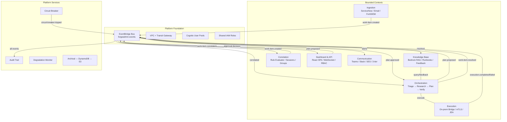

# ForgeAdmin — AI-Powered IT Operations Platform

## Overview

ForgeAdmin is an autonomous IT operations platform built for the Ohio Department of Transportation. It uses a multi-agent AI architecture to triage, plan, execute, and verify IT operations — with human-in-the-loop approval gates for risky actions.

## Architecture

## Bounded Contexts

| Context | Responsibility | Pattern |
|---------|---------------|---------|
| **Ingestion** | Normalize work items from ServiceNow, email, FortiSIEM | Simple Lambda |
| **Orchestration** | Multi-agent pipeline: Triage → Research → Plan → Execute → Verify | Hexagonal |
| **Execution** | Bridge to on-prem infrastructure, execute approved plans | Hexagonal |
| **Knowledge Base** | RAG-powered runbook storage and retrieval via Bedrock | Simple Lambda |
| **Correlation** | Incident correlation and pattern detection across work items | Hexagonal |
| **Dashboard & API** | Human-in-the-loop approvals, real-time monitoring | React + Lambda |
| **Communication** | Teams/Slack/email notifications with 3-tier escalation | Simple Lambda |
| **Platform** | Observability, audit trail, circuit breaker, archival | Terraform + Lambda |

## Detailed Architecture Diagrams

- **[Complete System Map](./architecture/system-map.md)** — Full infrastructure, data flow, deployment, security, and feedback loop diagrams (Mermaid)
- **[Context Map](./architecture/context-map.md)** — Event flows, cross-context relationships, and contract registry

## Key Design Decisions

All architectural decisions are documented in [ADRs](./adr/):

- [ADR-0001](./adr/0001-event-driven-microservices.md) — Event-driven microservices
- [ADR-0002](./adr/0002-eventbridge-plus-sqs-hybrid.md) — EventBridge + SQS hybrid transport
- [ADR-0003](./adr/0003-hexagonal-for-complex-contexts.md) — Hexagonal for complex contexts
- [ADR-0004](./adr/0004-dynamodb-plus-s3-tiered-storage.md) — DynamoDB + S3 tiered storage
- [ADR-0005](./adr/0005-terraform-independent-state-per-context.md) — Independent Terraform state per context
- [ADR-0006](./adr/0006-react-spa-serverless-dashboard.md) — React SPA + serverless dashboard
- [ADR-0007](./adr/0007-aws-native-observability.md) — AWS-native observability
- [ADR-0008](./adr/0008-json-schema-openapi-contracts.md) — JSON Schema + OpenAPI contracts

## Getting Started

See [QUICKSTART.md](./QUICKSTART.md) for setup instructions.

## Documentation

- [Architecture Context Map](./architecture/context-map.md) — Bounded context relationships, event flows, and Mermaid diagrams
- [Architecture Decision Records](./adr/README.md) — 8 ADRs documenting key design choices
- [Implementation Tasks](./tasks/README.md) — 16 task groups across 10 execution waves
- [Feature Design Specs](./superpowers/specs/) — Detailed designs for major features (correlation, feedback loop, confidence calibration, etc.)

## Implementation Progress

**Status: ✅ All 10 waves complete** — 285 tests passing, 9 Terraform modules validating, full E2E pipeline tested.

See [Task Groups](./tasks/README.md) for the full implementation breakdown across 16 task groups and 10 execution waves.

### What's Deployed

- **Terraform Infrastructure**: Foundation + 8 bounded context modules (all validate cleanly)
- **Domain Logic**: All 5 orchestration agents (Triage, Research, Planning, Verification, Supervisor)
- **Ingestion**: Normalizers for ServiceNow/Email/FortiSIEM + deduplication + event publisher
- **Execution**: Orchestrator with halt-on-failure + rollback + playbook expansion
- **Correlation**: Rule evaluator + session manager + group finalizer (temporal, causal, infra, repeat rules)
- **Platform Services**: Audit trail, circuit breaker, graceful degradation, sensitive data redaction
- **Dashboard**: Module state management + RBAC + WebSocket handler + Zustand stores
- **Communication**: Notification dispatcher + morning digest + NL command handler
- **Knowledge Base**: Query handler + runbook generator + feedback capture
- **Feedback Loop**: Capture handler + guardrail rules + calibration computation
- **Contracts**: 26 event schemas + OpenAPI 3.1 spec + 6 command-registry defs + 4 correlation rules + contract validator
- **CI/CD**: GitHub Actions (PR checks + Terraform deploy with rollback)
- **Property Tests**: 9 property test files covering formal invariant proofs (fast-check)
