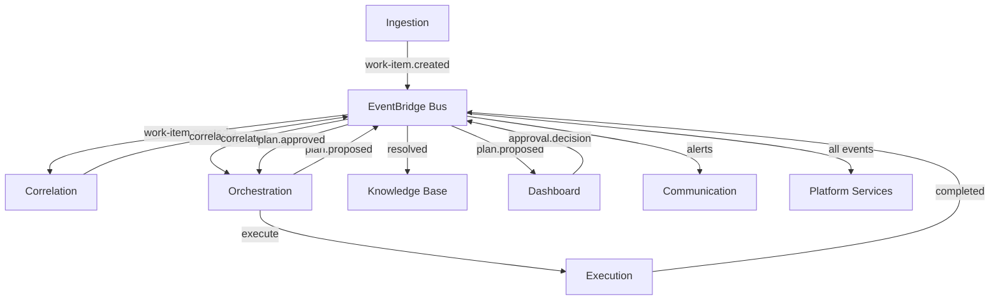

# ForgeAdmin — AI-Powered IT Operations Platform

## Overview

ForgeAdmin is an autonomous IT operations platform built for the Ohio Department of Transportation. It uses a multi-agent AI architecture to triage, plan, execute, and verify IT operations — with human-in-the-loop approval gates for risky actions.

## Architecture

For the **complete AWS architecture** showing every resource (25 Lambdas, 10 DynamoDB tables, 10 SQS queues, Step Functions, Bedrock, CloudFront, VPC, and all connections), see the **[Complete System Map](./architecture/system-map.md)**.

## Bounded Contexts

| Context | Responsibility | Pattern |
|---------|---------------|---------|
| **Ingestion** | Normalize work items from ServiceNow, email, FortiSIEM | Simple Lambda |
| **Orchestration** | Multi-agent pipeline: Triage, Research, Plan, Execute, Verify | Hexagonal |
| **Execution** | Bridge to on-prem infrastructure, execute approved plans | Hexagonal |
| **Knowledge Base** | RAG-powered runbook storage and retrieval via Bedrock | Simple Lambda |
| **Correlation** | Incident correlation and pattern detection across work items | Simple Lambda |
| **Dashboard and API** | Human-in-the-loop approvals, real-time monitoring | React + Lambda |
| **Communication** | Teams, Slack, email notifications with 3-tier escalation | Simple Lambda |
| **Platform** | Observability, audit trail, circuit breaker, archival | Terraform + Lambda |

## AWS Resource Summary

| Service | Count | Purpose |
|---------|-------|---------|
| Lambda | 25 | All domain logic (agents, handlers, monitors) |
| DynamoDB | 10 | State storage for each bounded context |
| SQS | 10 | Event buffering + dead letter queues |
| S3 | 5 | SPA hosting, runbooks, feedback docs, audit archive |
| API Gateway | 2 | Webhook ingestion + execution callbacks |
| Step Functions | 1 | Multi-agent orchestration workflow |
| EventBridge | 1 bus + 4 rules | Central event routing + scheduled triggers |
| CloudFront | 1 | Dashboard SPA with HTTPS |
| Cognito | 1 pool | Authentication with team_lead and team_member roles |
| Bedrock | 1 | Claude and Titan model access for AI agents |
| VPC | 1 | Networking with NAT, VPC endpoints, Transit Gateway |
| Secrets Manager | 1 | mTLS certificates for on-prem bridge |

**Total: ~115 AWS resources across 9 Terraform modules**

## Detailed Architecture Diagrams

All diagrams use Mermaid and render directly on GitHub:

- **[Complete System Map](./architecture/system-map.md)** — Full AWS architecture with every resource, connection, and data flow
- **[Context Map](./architecture/context-map.md)** — Event flows, cross-context relationships, and contract registry

The system map includes:
- Complete AWS resource topology (all 8 bounded contexts + foundation)
- Step Functions orchestration pipeline flow
- Tiered storage lifecycle (DynamoDB to S3-IA to Glacier)
- Terraform deployment dependency graph
- 3-tier notification escalation flow
- RBAC security flow (Cognito to API Gateway to Lambda)
- Feedback loop continuous learning cycle

## Key Design Decisions

All architectural decisions are documented in [ADRs](./adr/):

- [ADR-0001](./adr/0001-event-driven-microservices.md) — Event-driven microservices
- [ADR-0002](./adr/0002-eventbridge-plus-sqs-hybrid.md) — EventBridge + SQS hybrid transport
- [ADR-0003](./adr/0003-hexagonal-for-complex-contexts.md) — Hexagonal for complex contexts
- [ADR-0004](./adr/0004-dynamodb-plus-s3-tiered-storage.md) — DynamoDB + S3 tiered storage
- [ADR-0005](./adr/0005-terraform-independent-state-per-context.md) — Independent Terraform state per context
- [ADR-0006](./adr/0006-react-spa-serverless-dashboard.md) — React SPA + serverless dashboard
- [ADR-0007](./adr/0007-aws-native-observability.md) — AWS-native observability
- [ADR-0008](./adr/0008-json-schema-openapi-contracts.md) — JSON Schema + OpenAPI contracts

## Contracts

| Type | Location | Description |
|------|----------|-------------|
| Event Schemas | `contracts/events/` | 26 JSON Schema event definitions across 9 namespaces |
| OpenAPI | `contracts/api/openapi.yaml` | Dashboard REST API (Modules, Approvals, Executions, Audit, Agents) |
| Command Registry | `contracts/command-registry/` | PowerShell cmdlet definitions for on-prem execution |
| Correlation Rules | `contracts/correlation-rules/` | Temporal, causal, infrastructure, and repeat pattern rules |
| Common Schema | `contracts/events/common/` | Shared EventEnvelope definitions |

## Testing

| Category | Count | Framework |
|----------|-------|-----------|
| Unit tests | 285 total | Vitest |
| Property tests | 12 properties | fast-check (50-200 runs each) |
| Integration tests | 6 E2E flows | Vitest (cross-context wiring) |
| Contract tests | 101 assertions | Ajv JSON Schema validation |
| Terraform validation | 9 modules | terraform validate |

All tests run via `pnpm test` or `./node_modules/.bin/vitest run`.

## Getting Started

See [QUICKSTART.md](./QUICKSTART.md) for setup instructions.

## Documentation Index

| Document | Description |
|----------|-------------|
| [QUICKSTART.md](./QUICKSTART.md) | Prerequisites, setup, deploy, verify |
| [architecture/system-map.md](./architecture/system-map.md) | Complete AWS architecture (Mermaid) |
| [architecture/context-map.md](./architecture/context-map.md) | Context relationships and event registry |
| [tasks/README.md](./tasks/README.md) | Implementation progress (all 10 waves complete) |
| [adr/](./adr/) | 8 Architecture Decision Records |
| [superpowers/specs/](./superpowers/specs/) | Feature design specs (correlation, feedback, calibration, playbook, dry-run) |

## Implementation Status

**All 10 waves complete.** Every task built via RED/GREEN/REFACTOR TDD.

| Wave | Focus | Status |
|------|-------|--------|
| 0 | Monorepo setup, ADRs | ✅ |
| 1 | Terraform foundation, shared utilities, event schemas | ✅ |
| 2 | Platform context, deploy scripts, OpenAPI, contract validation | ✅ |
| 3 | CI/CD + all context Terraform modules | ✅ |
| 4 | Domain models, ports, normalizers, command registry | ✅ |
| 5 | Agent logic (Triage, Research, Planning, Verification), execution orchestrator, correlation engine | ✅ |
| 6 | Property tests, adapters, KB handlers, Supervisor Agent, feedback models | ✅ |
| 7 | Platform services (audit, circuit breaker, degradation, redaction), handlers, correlation property tests | ✅ |
| 8 | Dashboard API, module state, WebSocket, communication handlers, calibration | ✅ |
| 9 | React frontend stores, shadow mode, connectivity monitor, playbook expander | ✅ |
| 10 | Integration tests (E2E pipeline, circuit breaker, shadow mode, degradation, correlation) | ✅ |

Internal Use Only - Ohio Department of Transportation. 