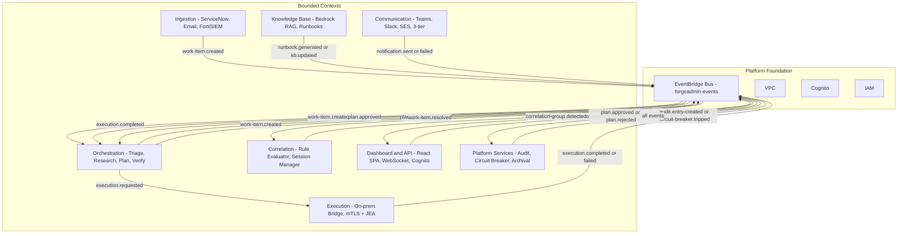
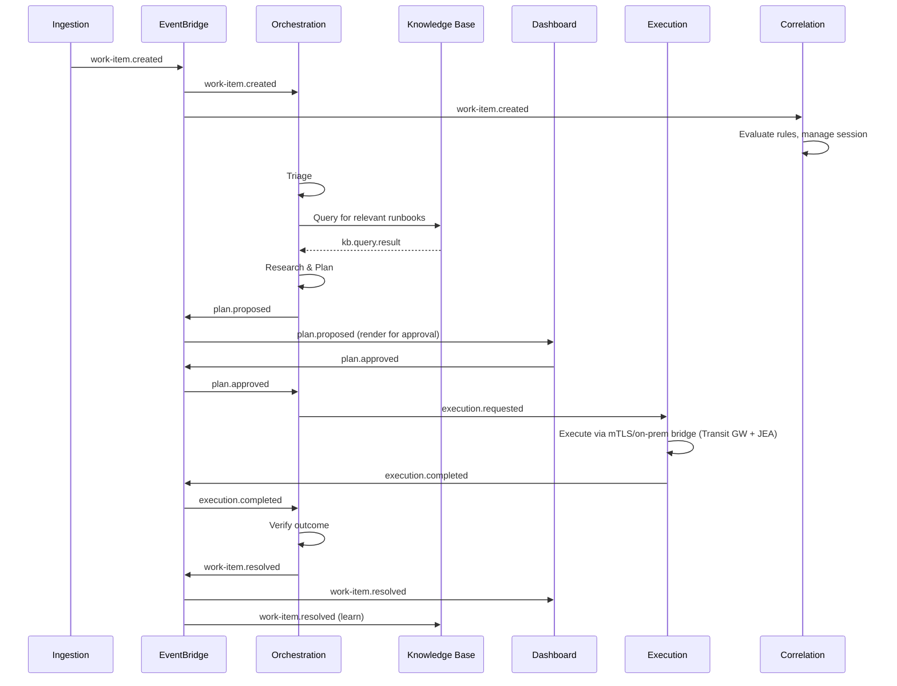
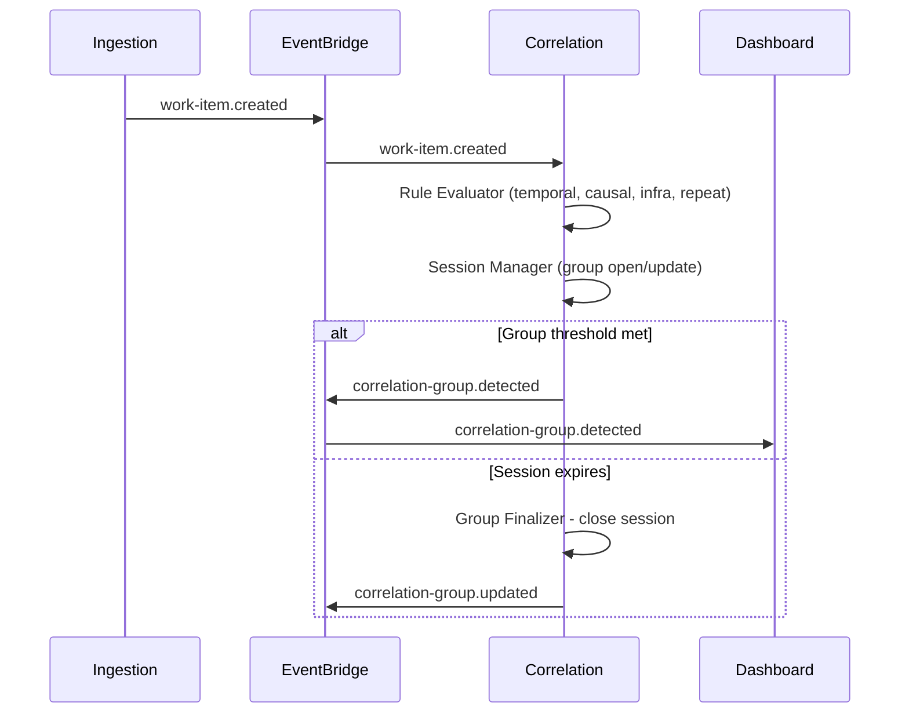

# ForgeAdmin Context Map

## Visual Map

## Event Flows

### Happy Path: Work Item to Resolution

### Correlation Flow: Pattern Detection

## Cross-Context Event Registry

| Event | Producer | Consumers |
|-------|----------|-----------|
| `work-item.created` | Ingestion | Orchestration, Correlation, Dashboard, Audit |
| `triage.completed` | Orchestration | Dashboard, Audit |
| `plan.proposed` | Orchestration | Dashboard, Audit |
| `plan.approved` | Dashboard | Orchestration, Audit |
| `plan.rejected` | Dashboard | Orchestration, Audit |
| `execution.completed` | Execution | Orchestration, Dashboard, Audit |
| `execution.failed` | Execution | Orchestration, Dashboard, Communication, Audit |
| `verification.completed` | Orchestration | Dashboard, Knowledge Base, Audit |
| `work-item.resolved` | Orchestration | All contexts |
| `work-item.correlated` | Correlation | Orchestration, Dashboard, Audit |
| `correlation-group.detected` | Correlation | Dashboard, Orchestration, Audit |
| `correlation-group.updated` | Correlation | Dashboard, Audit |
| `runbook.generated` | Knowledge Base | Dashboard, Audit |
| `kb.updated` | Knowledge Base | Audit |
| `feedback.captured` | Knowledge Base | Orchestration, Audit |
| `feedback.summary-updated` | Orchestration | Dashboard, Audit |
| `circuit-breaker.tripped` | Platform | All contexts, Communication |
| `dlq.message-received` | Platform | Dashboard, Communication |
| `notification.sent` | Communication | Audit |
| `notification.failed` | Communication | Dashboard, Audit |
| `audit.entry-created` | Platform | Dashboard |
| `module.state-changed` | Dashboard | Orchestration, Communication |
| `skill.updated` | Dashboard | Orchestration, Audit |
| `steering.updated` | Dashboard | Orchestration, Audit |
| `approval.decision` | Dashboard | Orchestration, Audit |

## Relationship Types

- **Ingestion → Orchestration**: Upstream/Downstream (Conformist — Orchestration consumes Ingestion's events as-is)
- **Ingestion → Correlation**: Upstream/Downstream (Conformist — Correlation consumes work-item events)
- **Orchestration → Execution**: Partnership (co-evolve execution contract)
- **Orchestration ↔ Knowledge Base**: Partnership (query/response pattern + feedback loop)
- **Correlation → Orchestration**: Upstream/Downstream (correlation groups influence triage priority)
- **Dashboard → Orchestration**: Customer/Supplier (Dashboard drives approval workflow)
- **Platform → All**: Published Language (standard audit/circuit-breaker/DLQ events)
- **Communication → All**: Generic Subdomain (notification routing, no domain logic)

## Contract References

| Contract Type | Location | Description |
|--------------|----------|-------------|
| OpenAPI 3.1 | `contracts/api/openapi.yaml` | Dashboard REST API (Modules, Approvals, Executions, Audit, Agents) |
| Event Schemas | `contracts/events/{context}/*.schema.json` | 26 JSON Schema event definitions across 9 namespaces |
| Command Registry | `contracts/command-registry/{category}/*.json` | PowerShell command definitions for on-prem execution (AD, DNS, Services) |
| Correlation Rules | `contracts/correlation-rules/{type}/*.json` | Rule schemas for temporal, causal, infrastructure, and repeat patterns |
| Event Envelope | `contracts/events/common/event-envelope.schema.json` | Standard envelope wrapping all domain events |
