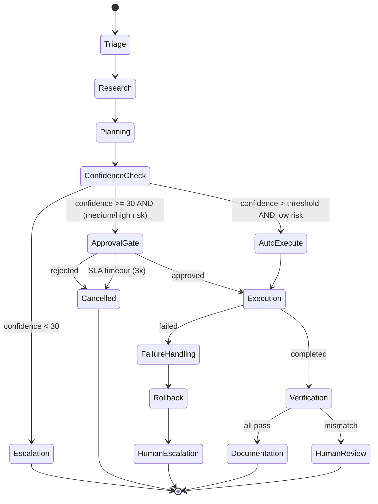
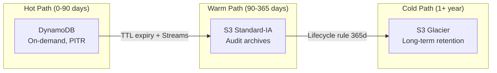
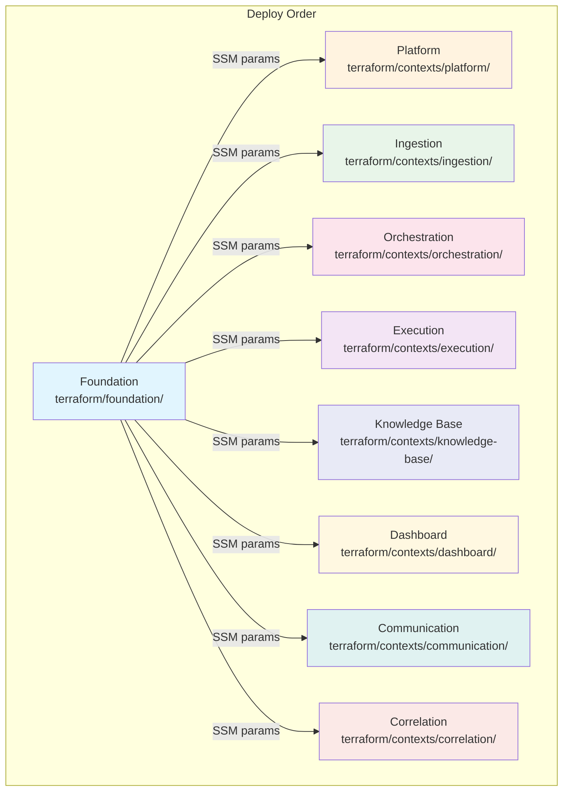
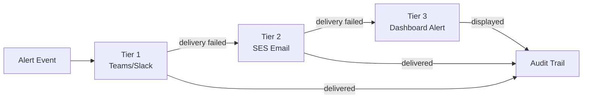
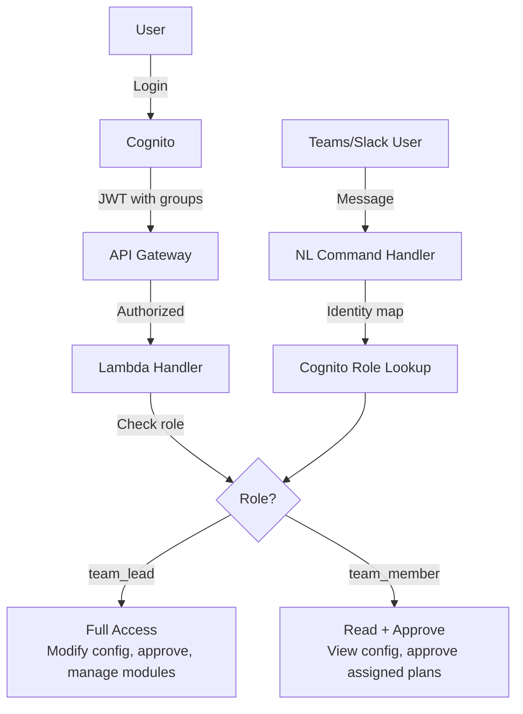
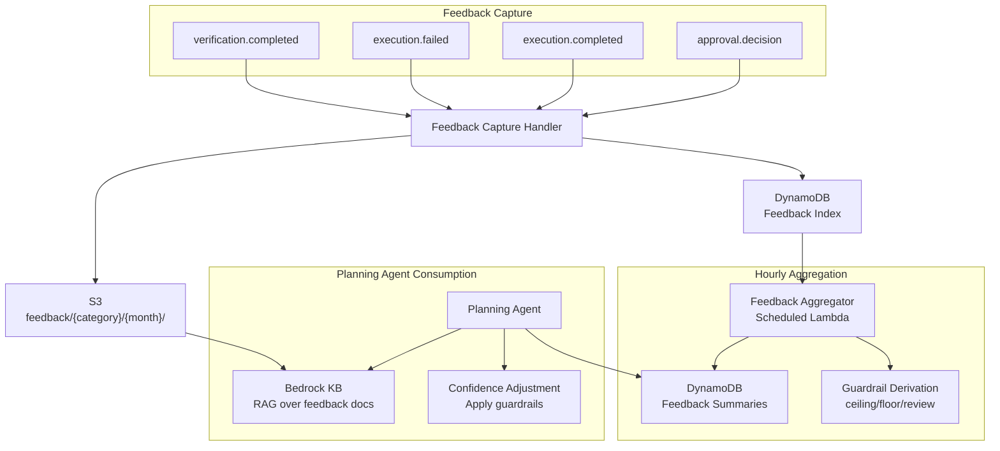

# ForgeAdmin — Complete System Map

## Complete AWS Architecture

```mermaid
graph TB
    %% ==================== EXTERNAL SYSTEMS ====================
    subgraph External["External Systems"]
        SN[ServiceNow<br/>Incident Management]
        EMAIL_IN[Email<br/>servers@dot.ohio.gov]
        SIEM[FortiSIEM<br/>Security Events]
        TEAMS[Microsoft Teams<br/>/ Slack]
        ONPREM[On-Premises Servers<br/>AD / DNS / Services]
    end

    %% ==================== FOUNDATION LAYER ====================
    subgraph Foundation["Foundation Layer — terraform/foundation"]
        subgraph VPCBlock["VPC — 10.0.0.0/16"]
            subgraph PublicSubnets["Public Subnets — 10.0.101.0/24, 10.0.102.0/24"]
                IGW[Internet Gateway]
                NAT[NAT Gateway<br/>+ Elastic IP]
            end
            subgraph PrivateSubnets["Private Subnets — 10.0.1.0/24, 10.0.2.0/24"]
                SG_LAMBDA[Security Group<br/>forgeadmin-lambda<br/>All Outbound]
                VPCE_DDB[VPC Endpoint<br/>DynamoDB Gateway]
                VPCE_S3[VPC Endpoint<br/>S3 Gateway]
            end
        end

        EB[EventBridge Bus<br/>forgeadmin-events]
        EB_ARCHIVE[Event Archive<br/>90-day retention]
        EB_DLQ[SQS — EventBridge DLQ<br/>14-day retention]
        SCHEMA_REG[Schema Registry<br/>forgeadmin-registry]

        COG_POOL[Cognito User Pool<br/>forgeadmin-users<br/>MFA Optional]
        COG_LEAD[Group: team_lead<br/>Full access]
        COG_MEMBER[Group: team_member<br/>Read + approve]
        COG_CLIENT[OAuth Client<br/>PKCE / Code Flow]
        COG_DOMAIN[Auth Domain<br/>forgeadmin-dev]

        IAM_EB_PUB[IAM Role<br/>EventBridge Publisher<br/>events:PutEvents]
        IAM_OBSERV[IAM Policy<br/>Lambda Observability<br/>Logs + X-Ray + Metrics]
        IAM_VPC[IAM Policy<br/>VPC Access<br/>ENI Management]
        IAM_SSM[IAM Policy<br/>SSM Read<br/>Parameter Discovery]

        SSM[SSM Parameter Store<br/>10 cross-context params<br/>Bus ARN / VPC / Cognito / IAM]
    end

    %% ==================== INGESTION CONTEXT ====================
    subgraph Ingestion["Ingestion Context — terraform/contexts/ingestion"]
        APIGW_ING[API Gateway<br/>forgeadmin-ingestion-api<br/>POST /webhook]
        LAMBDA_SN[Lambda: servicenow-poller<br/>nodejs20.x / 30s / 256MB]
        LAMBDA_SES[Lambda: ses-handler<br/>nodejs20.x / 30s / 256MB]
        LAMBDA_SIEM[Lambda: fortisiem-webhook<br/>nodejs20.x / 30s / 256MB]
        EB_RULE_SN[EventBridge Rule<br/>rate — 5 minutes]
        DDB_WORK[DynamoDB: work-items<br/>On-demand / PITR / Streams<br/>GSI: sourceSystem-originalId]
        SQS_ING_DLQ[SQS: ingestion-dlq<br/>14-day retention]
        IAM_ING[3 IAM Roles<br/>DynamoDB + EventBridge]
    end

    %% ==================== CORRELATION CONTEXT ====================
    subgraph Correlation["Correlation Context — terraform/contexts/correlation"]
        LAMBDA_CORR_WI[Lambda: on-work-item-created<br/>nodejs20.x / 30s / 256MB]
        LAMBDA_CORR_EXP[Lambda: on-session-expired<br/>nodejs20.x / 30s / 256MB]
        LAMBDA_CORR_SW[Lambda: sweeper<br/>nodejs20.x / 30s / 256MB]
        EB_RULE_SW[EventBridge Rule<br/>rate — 5 minutes]
        SQS_CORR[SQS: correlation-input-buffer<br/>Visibility 60s / Redrive 3]
        SQS_CORR_DLQ[SQS: correlation-dlq<br/>14-day retention]
        DDB_SESSIONS[DynamoDB: correlation-sessions<br/>On-demand / PITR<br/>GSIs: ruleId-matchKey, status]
        DDB_RULES[DynamoDB: correlation-rules<br/>On-demand]
        IAM_CORR[3 IAM Roles<br/>DynamoDB + SQS + EventBridge<br/>+ Scheduler]
    end

    %% ==================== ORCHESTRATION CONTEXT ====================
    subgraph Orchestration["Orchestration Context — terraform/contexts/orchestration"]
        SFN[Step Functions<br/>orchestration-workflow<br/>Triage→Research→Planning→Verify]
        LAMBDA_TRIAGE[Lambda: triage-agent<br/>nodejs20.x / 60s / 512MB]
        LAMBDA_RESEARCH[Lambda: research-agent<br/>nodejs20.x / 60s / 512MB]
        LAMBDA_PLANNING[Lambda: planning-agent<br/>nodejs20.x / 60s / 512MB]
        LAMBDA_VERIFY[Lambda: verification-agent<br/>nodejs20.x / 60s / 512MB]
        LAMBDA_SUPER[Lambda: supervisor-agent<br/>nodejs20.x / 60s / 512MB]
        DDB_ORCH[DynamoDB: orchestration<br/>On-demand / PITR / Streams<br/>GSIs: status-createdAt, category-riskLevel]
        BEDROCK[Amazon Bedrock<br/>Claude / Titan<br/>bedrock:InvokeModel]
        IAM_SFN[IAM Role<br/>Step Functions<br/>states:StartExecution<br/>lambda:InvokeFunction]
        IAM_ORCH[5 IAM Roles<br/>DynamoDB + EventBridge + Bedrock]
    end

    %% ==================== KNOWLEDGE BASE CONTEXT ====================
    subgraph KnowledgeBase["Knowledge Base Context — terraform/contexts/knowledge-base"]
        LAMBDA_KB_Q[Lambda: kb-query-handler<br/>nodejs20.x / 60s / 512MB]
        LAMBDA_KB_RB[Lambda: runbook-generator<br/>nodejs20.x / 60s / 512MB]
        LAMBDA_KB_UP[Lambda: kb-updater<br/>nodejs20.x / 60s / 512MB]
        S3_KB_DOCS[S3: kb-source-documents<br/>Versioned]
        S3_RUNBOOKS[S3: kb-runbooks<br/>Versioned]
        DDB_KB_GAP[DynamoDB: knowledge-gap-tracker<br/>On-demand]
        IAM_KB[3 IAM Roles<br/>S3 + DynamoDB + EventBridge]
    end

    %% ==================== EXECUTION CONTEXT ====================
    subgraph Execution["Execution Context — terraform/contexts/execution"]
        APIGW_EXEC[API Gateway<br/>forgeadmin-execution-api<br/>POST /callback]
        LAMBDA_EXEC_H[Lambda: execution-handler<br/>nodejs20.x / 120s / 512MB]
        LAMBDA_EXEC_CB[Lambda: callback-handler<br/>nodejs20.x / 120s / 512MB]
        LAMBDA_EXEC_TO[Lambda: timeout-handler<br/>nodejs20.x / 120s / 512MB]
        SQS_EXEC[SQS: execution-queue<br/>Visibility 900s / Redrive 3]
        SQS_EXEC_DLQ[SQS: execution-dlq<br/>14-day retention]
        DDB_EXEC[DynamoDB: execution-state<br/>On-demand<br/>GSI: planId-index]
        SECRETS[Secrets Manager<br/>mTLS Certificates]
        TGW[Transit Gateway<br/>→ On-Prem Network]
        IAM_EXEC[3 IAM Roles<br/>DynamoDB + SQS + EventBridge<br/>+ SecretsManager]
    end

    %% ==================== DASHBOARD CONTEXT ====================
    subgraph Dashboard["Dashboard Context — terraform/contexts/dashboard"]
        CF[CloudFront Distribution<br/>HTTPS / OAC]
        S3_SPA[S3: dashboard-spa<br/>React SPA / index.html]
        LAMBDA_API[Lambda: api-handler<br/>nodejs20.x / 30s / 256MB]
        LAMBDA_WS_C[Lambda: websocket-connect<br/>nodejs20.x / 30s / 256MB]
        LAMBDA_WS_D[Lambda: websocket-disconnect<br/>nodejs20.x / 30s / 256MB]
        DDB_DASH[DynamoDB: dashboard<br/>On-demand<br/>GSIs: state-index, approval-status]
        IAM_DASH[3 IAM Roles<br/>DynamoDB + EventBridge]
    end

    %% ==================== COMMUNICATION CONTEXT ====================
    subgraph Communication["Communication Context — terraform/contexts/communication"]
        LAMBDA_NOTIF[Lambda: notification-dispatcher<br/>nodejs20.x / 30s / 256MB]
        LAMBDA_DIGEST[Lambda: morning-digest<br/>nodejs20.x / 30s / 256MB]
        LAMBDA_NL[Lambda: nl-command-handler<br/>nodejs20.x / 30s / 256MB]
        LAMBDA_ESC[Lambda: escalation-handler<br/>nodejs20.x / 30s / 256MB]
        EB_RULE_DIGEST[EventBridge Rule<br/>cron 0 12 * * ? *<br/>7AM ET Daily]
        SQS_COMM[SQS: communication-queue<br/>Visibility 60s / Redrive 3]
        SQS_COMM_DLQ[SQS: communication-dlq<br/>14-day retention]
        DDB_COMM[DynamoDB: notification-state<br/>On-demand / TTL 30d]
        IAM_COMM[4 IAM Roles<br/>DynamoDB + SQS + EventBridge]
    end

    %% ==================== PLATFORM CONTEXT ====================
    subgraph Platform["Platform Services — terraform/contexts/platform"]
        LAMBDA_DLQ_MON[Lambda: dlq-monitor<br/>nodejs20.x / 30s / 256MB<br/>X-Ray Active]
        LAMBDA_ARCH[Lambda: audit-archival<br/>nodejs20.x / 60s / 256MB<br/>X-Ray Active]
        DDB_AUDIT[DynamoDB: audit-trail<br/>On-demand / PITR / Streams<br/>TTL 90d<br/>GSIs: actor-timestamp, context-action]
        S3_PLATFORM[S3: platform-storage<br/>Versioned / KMS Encrypted<br/>Lifecycle: 90d→IA, 365d→Glacier]
        CW_DASH[CloudWatch Dashboard<br/>platform-overview]
        CW_ALARM_DLQ[CloudWatch Alarm<br/>DLQ Depth > 0]
        CW_ALARM_ERR[CloudWatch Alarm<br/>Lambda Error Rate > 5]
        SNS_ALARMS[SNS: platform-alarms<br/>Email subscription]
        ESM_AUDIT[Event Source Mapping<br/>DynamoDB Streams → Archival<br/>Filter: REMOVE events]
        IAM_PLAT[2 IAM Roles<br/>SQS + SNS + DynamoDB Streams + S3]
    end

    %% ==================== CONNECTIONS ====================

    %% External → Ingestion
    SN -.->|Poll every 5min| LAMBDA_SN
    EMAIL_IN -.->|SES Receipt Rule| LAMBDA_SES
    SIEM -.->|POST /webhook| APIGW_ING
    APIGW_ING --> LAMBDA_SIEM

    %% Ingestion internal
    EB_RULE_SN -->|Invoke| LAMBDA_SN
    LAMBDA_SN --> DDB_WORK
    LAMBDA_SES --> DDB_WORK
    LAMBDA_SIEM --> DDB_WORK
    LAMBDA_SN -->|work-item.created| EB
    LAMBDA_SES -->|work-item.created| EB
    LAMBDA_SIEM -->|work-item.created| EB

    %% EventBridge → Correlation
    EB -->|work-item.created| SQS_CORR
    SQS_CORR --> LAMBDA_CORR_WI
    LAMBDA_CORR_WI --> DDB_SESSIONS
    LAMBDA_CORR_WI --> DDB_RULES
    LAMBDA_CORR_WI -->|work-item.correlated| EB
    LAMBDA_CORR_WI -->|correlation-group.detected| EB
    EB_RULE_SW -->|Invoke| LAMBDA_CORR_SW
    LAMBDA_CORR_SW --> DDB_SESSIONS

    %% EventBridge → Orchestration
    EB -->|work-item.correlated| SFN
    SFN --> LAMBDA_TRIAGE
    SFN --> LAMBDA_RESEARCH
    SFN --> LAMBDA_PLANNING
    SFN --> LAMBDA_VERIFY
    SFN --> LAMBDA_SUPER
    LAMBDA_TRIAGE --> DDB_ORCH
    LAMBDA_RESEARCH --> BEDROCK
    LAMBDA_PLANNING --> BEDROCK
    LAMBDA_PLANNING -->|plan.proposed| EB
    LAMBDA_VERIFY -->|work-item.resolved| EB

    %% Orchestration → Knowledge Base
    LAMBDA_RESEARCH --> LAMBDA_KB_Q
    LAMBDA_KB_Q --> S3_KB_DOCS
    LAMBDA_KB_Q --> DDB_KB_GAP
    LAMBDA_KB_RB --> S3_RUNBOOKS
    LAMBDA_KB_RB -->|runbook.generated| EB
    LAMBDA_KB_UP --> S3_KB_DOCS

    %% EventBridge → Dashboard
    EB -->|plan.proposed| LAMBDA_WS_C
    EB -->|events| LAMBDA_API
    CF --> S3_SPA
    LAMBDA_API --> DDB_DASH
    LAMBDA_API -->|approval.decision| EB
    LAMBDA_WS_C --> DDB_DASH

    %% EventBridge → Execution
    EB -->|plan.approved| SQS_EXEC
    SQS_EXEC --> LAMBDA_EXEC_H
    LAMBDA_EXEC_H --> DDB_EXEC
    LAMBDA_EXEC_H --> SECRETS
    LAMBDA_EXEC_H --> TGW
    TGW -.->|mTLS / JEA| ONPREM
    ONPREM -.->|Callback POST| APIGW_EXEC
    APIGW_EXEC --> LAMBDA_EXEC_CB
    LAMBDA_EXEC_CB -->|execution.completed| EB
    LAMBDA_EXEC_CB -->|execution.failed| EB
    LAMBDA_EXEC_CB --> DDB_EXEC

    %% EventBridge → Communication
    EB -->|alerts + notifications| SQS_COMM
    SQS_COMM --> LAMBDA_NOTIF
    LAMBDA_NOTIF -.->|Webhooks| TEAMS
    EB_RULE_DIGEST -->|Daily 7AM| LAMBDA_DIGEST
    LAMBDA_DIGEST -.->|Digest| TEAMS
    TEAMS -.->|NL Commands| LAMBDA_NL
    LAMBDA_NOTIF --> DDB_COMM
    LAMBDA_NL --> DDB_COMM

    %% EventBridge → Platform
    EB -->|All events| LAMBDA_DLQ_MON
    DDB_AUDIT -->|Streams REMOVE| ESM_AUDIT
    ESM_AUDIT --> LAMBDA_ARCH
    LAMBDA_ARCH --> S3_PLATFORM
    CW_ALARM_DLQ --> SNS_ALARMS
    CW_ALARM_ERR --> SNS_ALARMS
    LAMBDA_DLQ_MON --> SNS_ALARMS

    %% Cognito → Dashboard
    COG_POOL --> COG_CLIENT
    COG_CLIENT -.->|JWT Auth| CF

    %% Cross-cutting
    SSM -.->|Discovery| Ingestion
    SSM -.->|Discovery| Orchestration
    SSM -.->|Discovery| Execution
    SSM -.->|Discovery| KnowledgeBase
    SSM -.->|Discovery| Dashboard
    SSM -.->|Discovery| Communication
    SSM -.->|Discovery| Correlation
    SSM -.->|Discovery| Platform
```

## AWS Resource Inventory

| Service | Resource Count | Details |
|---------|---------------|---------|
| **Lambda** | 25 functions | Ingestion: 3, Orchestration: 5, Execution: 3, KB: 3, Dashboard: 3, Communication: 4, Correlation: 3, Platform: 2 |
| **DynamoDB** | 10 tables | work-items, orchestration, execution-state, knowledge-gap-tracker, dashboard, notification-state, correlation-sessions, correlation-rules, audit-trail |
| **SQS** | 10 queues | 5 main queues + 5 DLQs (EventBridge DLQ, ingestion, execution, communication, correlation) |
| **S3** | 5 buckets | platform-storage, dashboard-spa, kb-source-documents, kb-runbooks, terraform-state |
| **API Gateway** | 2 REST APIs | ingestion-api (POST /webhook), execution-api (POST /callback) |
| **Step Functions** | 1 state machine | orchestration-workflow (Triage→Research→Planning→Verify→Complete) |
| **EventBridge** | 1 bus + 4 rules | forgeadmin-events bus, 3 scheduled rules (poller, digest, sweeper), 1 archive |
| **CloudFront** | 1 distribution | Dashboard SPA with OAC → S3 origin |
| **Cognito** | 1 user pool | 2 groups (team_lead, team_member), 1 OAuth client, 1 domain |
| **CloudWatch** | 1 dashboard + 2 alarms | platform-overview, DLQ depth alarm, Lambda error alarm |
| **SNS** | 1 topic | platform-alarms (email subscription) |
| **Secrets Manager** | 1 secret | mTLS certificates for on-prem bridge |
| **VPC** | 1 VPC | 2 public subnets, 2 private subnets, 1 NAT, 1 IGW, 2 VPC endpoints (DynamoDB, S3) |
| **IAM** | ~30 roles/policies | 25 Lambda roles + SFN role + shared policies (observability, VPC, SSM, EventBridge) |
| **SSM** | 10 parameters | Cross-context discovery (bus, VPC, Cognito, IAM ARNs) |
| **Bedrock** | 1 model access | Claude/Titan via InvokeModel (Orchestration agents) |

**Total AWS resources: ~115**

## Orchestration Pipeline — Step Functions Flow



## Data Flow — Tiered Storage



## Deployment — Terraform State Independence



## Notification Escalation — 3-Tier



## Security — RBAC Flow



## Feedback Loop — Continuous Learning


