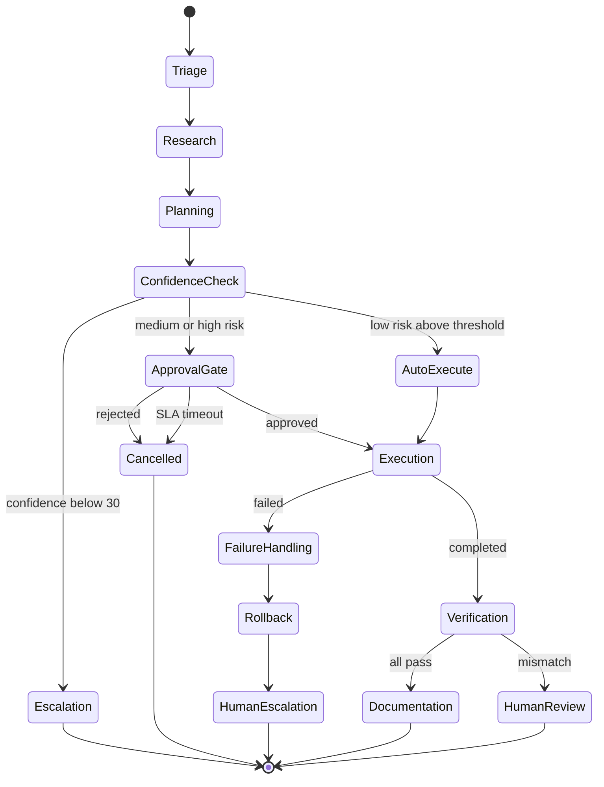
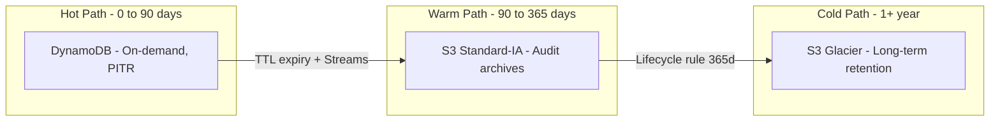
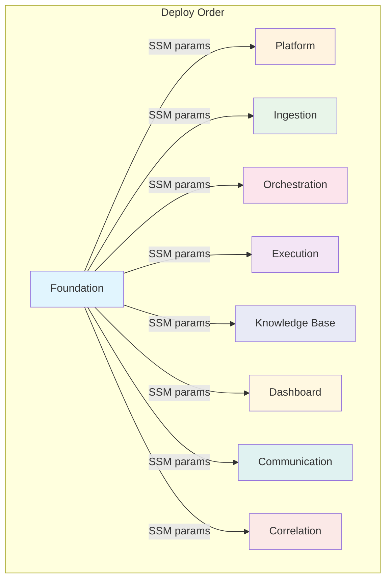
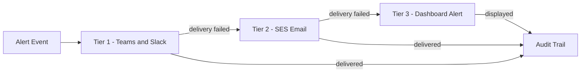
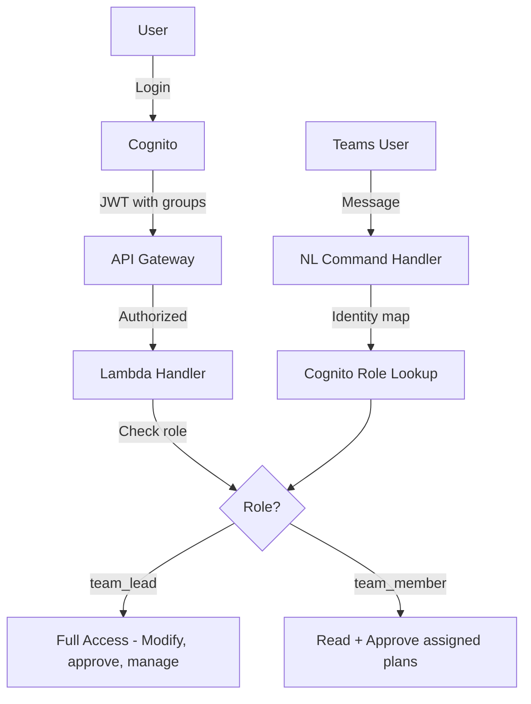
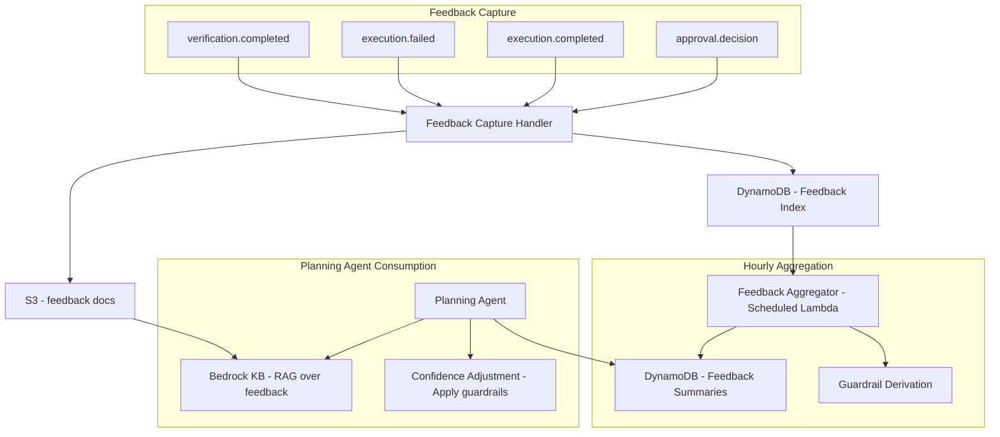

# ForgeAdmin — Complete System Map

## Complete AWS Architecture

```mermaid
graph TB
    %% ==================== EXTERNAL SYSTEMS ====================
    subgraph External["External Systems"]
        SN["ServiceNow - Incident Management"]
        EMAIL_IN["Email - SES Inbound"]
        SIEM["FortiSIEM - Security Events"]
        TEAMS["Microsoft Teams and Slack"]
        ONPREM["On-Premises Servers - AD, DNS, Services"]
    end

    %% ==================== FOUNDATION LAYER ====================
    subgraph Foundation["Foundation Layer"]
        subgraph VPCBlock["VPC 10.0.0.0 /16"]
            subgraph PublicSubnets["Public Subnets"]
                IGW["Internet Gateway"]
                NAT["NAT Gateway + EIP"]
            end
            subgraph PrivateSubnets["Private Subnets"]
                SG_LAMBDA["Security Group - Lambda"]
                VPCE_DDB["VPC Endpoint - DynamoDB"]
                VPCE_S3["VPC Endpoint - S3"]
            end
        end

        EB["EventBridge Bus - forgeadmin-events"]
        EB_ARCHIVE["Event Archive - 90 day"]
        EB_DLQ["SQS - EventBridge DLQ"]
        SCHEMA_REG["Schema Registry"]

        COG_POOL["Cognito User Pool - MFA"]
        COG_LEAD["Group: team_lead"]
        COG_MEMBER["Group: team_member"]
        COG_CLIENT["OAuth Client - PKCE"]
        COG_DOMAIN["Auth Domain"]

        IAM_EB_PUB["IAM Role - EventBridge Publisher"]
        IAM_OBSERV["IAM Policy - Observability"]
        IAM_VPC["IAM Policy - VPC Access"]
        IAM_SSM["IAM Policy - SSM Read"]

        SSM["SSM Parameter Store - 10 params"]
    end

    %% ==================== INGESTION CONTEXT ====================
    subgraph Ingestion["Ingestion Context"]
        APIGW_ING["API Gateway - POST /webhook"]
        LAMBDA_SN["Lambda: servicenow-poller - 30s 256MB"]
        LAMBDA_SES["Lambda: ses-handler - 30s 256MB"]
        LAMBDA_SIEM["Lambda: fortisiem-webhook - 30s 256MB"]
        EB_RULE_SN["EventBridge Rule - rate 5 min"]
        DDB_WORK["DynamoDB: work-items - Streams, GSI"]
        SQS_ING_DLQ["SQS: ingestion-dlq"]
    end

    %% ==================== CORRELATION CONTEXT ====================
    subgraph Correlation["Correlation Context"]
        LAMBDA_CORR_WI["Lambda: on-work-item-created"]
        LAMBDA_CORR_EXP["Lambda: on-session-expired"]
        LAMBDA_CORR_SW["Lambda: sweeper"]
        EB_RULE_SW["EventBridge Rule - rate 5 min"]
        SQS_CORR["SQS: correlation-input-buffer"]
        SQS_CORR_DLQ["SQS: correlation-dlq"]
        DDB_SESSIONS["DynamoDB: correlation-sessions - 2 GSIs"]
        DDB_RULES["DynamoDB: correlation-rules"]
    end

    %% ==================== ORCHESTRATION CONTEXT ====================
    subgraph Orchestration["Orchestration Context"]
        SFN["Step Functions - orchestration-workflow"]
        LAMBDA_TRIAGE["Lambda: triage-agent - 60s 512MB"]
        LAMBDA_RESEARCH["Lambda: research-agent - 60s 512MB"]
        LAMBDA_PLANNING["Lambda: planning-agent - 60s 512MB"]
        LAMBDA_VERIFY["Lambda: verification-agent - 60s 512MB"]
        LAMBDA_SUPER["Lambda: supervisor-agent - 60s 512MB"]
        DDB_ORCH["DynamoDB: orchestration - Streams, 2 GSIs"]
        BEDROCK["Amazon Bedrock - Claude, Titan"]
    end

    %% ==================== KNOWLEDGE BASE CONTEXT ====================
    subgraph KnowledgeBase["Knowledge Base Context"]
        LAMBDA_KB_Q["Lambda: kb-query-handler - 60s 512MB"]
        LAMBDA_KB_RB["Lambda: runbook-generator - 60s 512MB"]
        LAMBDA_KB_UP["Lambda: kb-updater - 60s 512MB"]
        S3_KB_DOCS["S3: kb-source-documents - Versioned"]
        S3_RUNBOOKS["S3: kb-runbooks - Versioned"]
        DDB_KB_GAP["DynamoDB: knowledge-gap-tracker"]
    end

    %% ==================== EXECUTION CONTEXT ====================
    subgraph Execution["Execution Context"]
        APIGW_EXEC["API Gateway - POST /callback"]
        LAMBDA_EXEC_H["Lambda: execution-handler - 120s 512MB"]
        LAMBDA_EXEC_CB["Lambda: callback-handler - 120s 512MB"]
        LAMBDA_EXEC_TO["Lambda: timeout-handler - 120s 512MB"]
        SQS_EXEC["SQS: execution-queue - Vis 900s"]
        SQS_EXEC_DLQ["SQS: execution-dlq"]
        DDB_EXEC["DynamoDB: execution-state - GSI planId"]
        SECRETS["Secrets Manager - mTLS Certs"]
        TGW["Transit Gateway"]
    end

    %% ==================== DASHBOARD CONTEXT ====================
    subgraph Dashboard["Dashboard Context"]
        CF["CloudFront Distribution - HTTPS"]
        S3_SPA["S3: dashboard-spa - React SPA"]
        LAMBDA_API["Lambda: api-handler - 30s 256MB"]
        LAMBDA_WS_C["Lambda: websocket-connect"]
        LAMBDA_WS_D["Lambda: websocket-disconnect"]
        DDB_DASH["DynamoDB: dashboard - 2 GSIs"]
    end

    %% ==================== COMMUNICATION CONTEXT ====================
    subgraph Communication["Communication Context"]
        LAMBDA_NOTIF["Lambda: notification-dispatcher"]
        LAMBDA_DIGEST["Lambda: morning-digest"]
        LAMBDA_NL["Lambda: nl-command-handler"]
        LAMBDA_ESC["Lambda: escalation-handler"]
        EB_RULE_DIGEST["EventBridge Rule - cron daily 7AM ET"]
        SQS_COMM["SQS: communication-queue"]
        SQS_COMM_DLQ["SQS: communication-dlq"]
        DDB_COMM["DynamoDB: notification-state - TTL 30d"]
    end

    %% ==================== PLATFORM CONTEXT ====================
    subgraph Platform["Platform Services"]
        LAMBDA_DLQ_MON["Lambda: dlq-monitor - X-Ray"]
        LAMBDA_ARCH["Lambda: audit-archival - X-Ray"]
        DDB_AUDIT["DynamoDB: audit-trail - Streams, TTL 90d, 2 GSIs"]
        S3_PLATFORM["S3: platform-storage - KMS, Lifecycle"]
        CW_DASH["CloudWatch Dashboard"]
        CW_ALARM_DLQ["CloudWatch Alarm - DLQ Depth"]
        CW_ALARM_ERR["CloudWatch Alarm - Lambda Errors"]
        SNS_ALARMS["SNS: platform-alarms"]
        ESM_AUDIT["Event Source Mapping - Streams"]
    end

    %% ==================== CONNECTIONS ====================

    %% External to Ingestion
    SN -.->|"Poll 5min"| LAMBDA_SN
    EMAIL_IN -.->|"SES Receipt"| LAMBDA_SES
    SIEM -.->|"POST"| APIGW_ING
    APIGW_ING --> LAMBDA_SIEM

    %% Ingestion internal
    EB_RULE_SN -->|"Invoke"| LAMBDA_SN
    LAMBDA_SN --> DDB_WORK
    LAMBDA_SES --> DDB_WORK
    LAMBDA_SIEM --> DDB_WORK
    LAMBDA_SN -->|"work-item.created"| EB
    LAMBDA_SES -->|"work-item.created"| EB
    LAMBDA_SIEM -->|"work-item.created"| EB

    %% EventBridge to Correlation
    EB -->|"work-item.created"| SQS_CORR
    SQS_CORR --> LAMBDA_CORR_WI
    LAMBDA_CORR_WI --> DDB_SESSIONS
    LAMBDA_CORR_WI --> DDB_RULES
    LAMBDA_CORR_WI -->|"work-item.correlated"| EB
    LAMBDA_CORR_WI -->|"group.detected"| EB
    EB_RULE_SW -->|"Invoke"| LAMBDA_CORR_SW
    LAMBDA_CORR_SW --> DDB_SESSIONS

    %% EventBridge to Orchestration
    EB -->|"work-item.correlated"| SFN
    SFN --> LAMBDA_TRIAGE
    SFN --> LAMBDA_RESEARCH
    SFN --> LAMBDA_PLANNING
    SFN --> LAMBDA_VERIFY
    SFN --> LAMBDA_SUPER
    LAMBDA_TRIAGE --> DDB_ORCH
    LAMBDA_RESEARCH --> BEDROCK
    LAMBDA_PLANNING --> BEDROCK
    LAMBDA_PLANNING -->|"plan.proposed"| EB
    LAMBDA_VERIFY -->|"work-item.resolved"| EB

    %% Orchestration to KB
    LAMBDA_RESEARCH --> LAMBDA_KB_Q
    LAMBDA_KB_Q --> S3_KB_DOCS
    LAMBDA_KB_Q --> DDB_KB_GAP
    LAMBDA_KB_RB --> S3_RUNBOOKS
    LAMBDA_KB_RB -->|"runbook.generated"| EB
    LAMBDA_KB_UP --> S3_KB_DOCS

    %% EventBridge to Dashboard
    EB -->|"plan.proposed"| LAMBDA_WS_C
    EB -->|"events"| LAMBDA_API
    CF --> S3_SPA
    LAMBDA_API --> DDB_DASH
    LAMBDA_API -->|"approval.decision"| EB
    LAMBDA_WS_C --> DDB_DASH

    %% EventBridge to Execution
    EB -->|"plan.approved"| SQS_EXEC
    SQS_EXEC --> LAMBDA_EXEC_H
    LAMBDA_EXEC_H --> DDB_EXEC
    LAMBDA_EXEC_H --> SECRETS
    LAMBDA_EXEC_H --> TGW
    TGW -.->|"mTLS JEA"| ONPREM
    ONPREM -.->|"Callback"| APIGW_EXEC
    APIGW_EXEC --> LAMBDA_EXEC_CB
    LAMBDA_EXEC_CB -->|"execution.completed"| EB
    LAMBDA_EXEC_CB -->|"execution.failed"| EB
    LAMBDA_EXEC_CB --> DDB_EXEC

    %% EventBridge to Communication
    EB -->|"alerts"| SQS_COMM
    SQS_COMM --> LAMBDA_NOTIF
    LAMBDA_NOTIF -.->|"Webhooks"| TEAMS
    EB_RULE_DIGEST -->|"Daily"| LAMBDA_DIGEST
    LAMBDA_DIGEST -.->|"Digest"| TEAMS
    TEAMS -.->|"NL Commands"| LAMBDA_NL
    LAMBDA_NOTIF --> DDB_COMM
    LAMBDA_NL --> DDB_COMM

    %% EventBridge to Platform
    EB -->|"All events"| LAMBDA_DLQ_MON
    DDB_AUDIT -->|"Streams REMOVE"| ESM_AUDIT
    ESM_AUDIT --> LAMBDA_ARCH
    LAMBDA_ARCH --> S3_PLATFORM
    CW_ALARM_DLQ --> SNS_ALARMS
    CW_ALARM_ERR --> SNS_ALARMS
    LAMBDA_DLQ_MON --> SNS_ALARMS

    %% Cognito to Dashboard
    COG_POOL --> COG_CLIENT
    COG_CLIENT -.->|"JWT Auth"| CF

    %% Cross-cutting SSM
    SSM -.-> Ingestion
    SSM -.-> Orchestration
    SSM -.-> Execution
    SSM -.-> KnowledgeBase
    SSM -.-> Dashboard
    SSM -.-> Communication
    SSM -.-> Correlation
    SSM -.-> Platform
```

## AWS Resource Inventory

| Service | Resource Count | Details |
|---------|---------------|---------|
| **Lambda** | 25 functions | Ingestion: 3, Orchestration: 5, Execution: 3, KB: 3, Dashboard: 3, Communication: 4, Correlation: 3, Platform: 2 |
| **DynamoDB** | 10 tables | work-items, orchestration, execution-state, knowledge-gap-tracker, dashboard, notification-state, correlation-sessions, correlation-rules, audit-trail |
| **SQS** | 10 queues | 5 main queues + 5 DLQs (EventBridge DLQ, ingestion, execution, communication, correlation) |
| **S3** | 5 buckets | platform-storage, dashboard-spa, kb-source-documents, kb-runbooks, terraform-state |
| **API Gateway** | 2 REST APIs | ingestion-api (POST /webhook), execution-api (POST /callback) |
| **Step Functions** | 1 state machine | orchestration-workflow (Triage, Research, Planning, Verify, Complete) |
| **EventBridge** | 1 bus + 4 rules | forgeadmin-events bus, 3 scheduled rules (poller, digest, sweeper), 1 archive |
| **CloudFront** | 1 distribution | Dashboard SPA with OAC to S3 origin |
| **Cognito** | 1 user pool | 2 groups (team_lead, team_member), 1 OAuth client, 1 domain |
| **CloudWatch** | 1 dashboard + 2 alarms | platform-overview, DLQ depth alarm, Lambda error alarm |
| **SNS** | 1 topic | platform-alarms (email subscription) |
| **Secrets Manager** | 1 secret | mTLS certificates for on-prem bridge |
| **VPC** | 1 VPC | 2 public subnets, 2 private subnets, 1 NAT, 1 IGW, 2 VPC endpoints (DynamoDB, S3) |
| **IAM** | ~30 roles and policies | 25 Lambda roles + SFN role + shared policies (observability, VPC, SSM, EventBridge) |
| **SSM** | 10 parameters | Cross-context discovery (bus, VPC, Cognito, IAM ARNs) |
| **Bedrock** | 1 model access | Claude and Titan via InvokeModel (Orchestration agents) |

**Total AWS resources: ~115**

## Orchestration Pipeline - Step Functions Flow

## Data Flow - Tiered Storage

## Deployment - Terraform State Independence

## Notification Escalation - 3 Tier

## Security - RBAC Flow

## Feedback Loop - Continuous Learning

