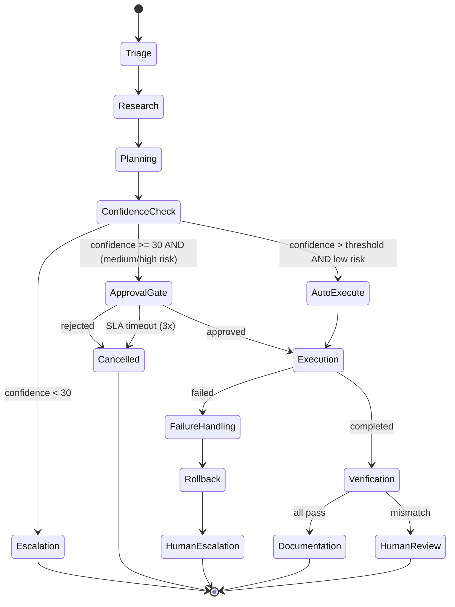
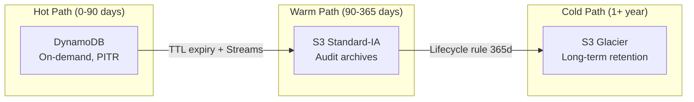
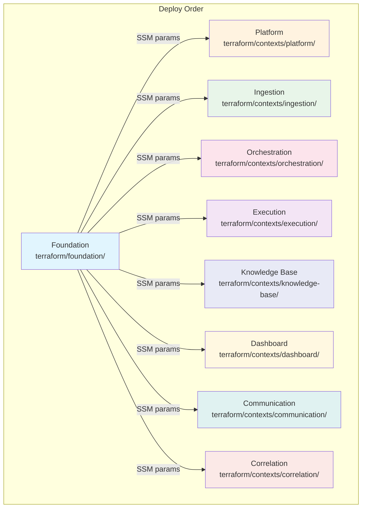
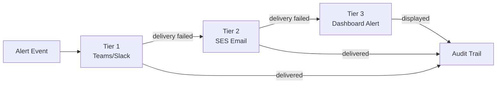
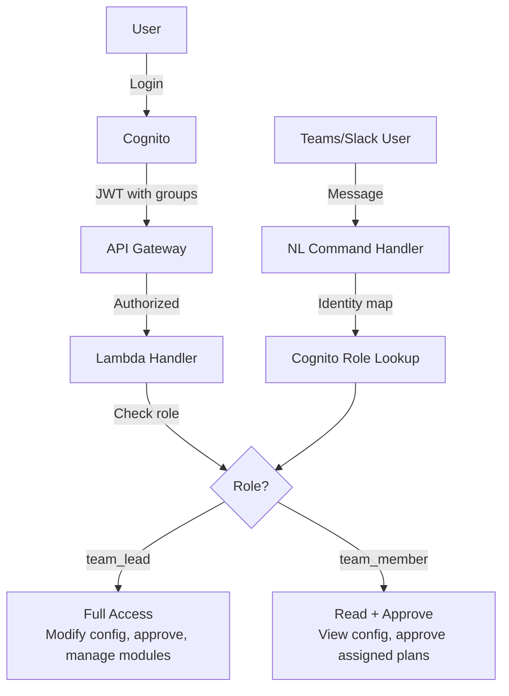

# ForgeAdmin — Complete System Map

## High-Level Architecture

```mermaid
graph TB
    subgraph External["External Systems"]
        SN[ServiceNow]
        EMAIL[Email — SES]
        SIEM[FortiSIEM]
        TEAMS[Teams / Slack]
        ONPREM[On-Prem Servers<br/>Active Directory / DNS / Services]
    end

    subgraph AWS["AWS Cloud — us-east-2"]
        subgraph Foundation["Foundation Layer"]
            EB[EventBridge Bus<br/>forgeadmin-events]
            VPC[VPC<br/>10.0.0.0/16]
            COG[Cognito<br/>team_lead / team_member]
            SSM[SSM Parameters<br/>Cross-context discovery]
            SCHEMA[Schema Registry]
        end

        subgraph Ingestion["Ingestion Context"]
            SN_POLL[ServiceNow Poller<br/>Lambda — 5min schedule]
            SES_H[SES Handler<br/>Lambda — receipt rule]
            SIEM_WH[FortiSIEM Webhook<br/>Lambda — API Gateway]
            ING_DDB[DynamoDB<br/>Work Items + Dedup GSI]
            ING_DLQ[SQS DLQ]
        end

        subgraph Correlation["Correlation Context"]
            CORR_H[on-work-item-created<br/>Lambda — SQS trigger]
            CORR_EXP[on-session-expired<br/>Lambda — Scheduler]
            CORR_SW[Sweeper<br/>Lambda — 5min schedule]
            CORR_SESS[DynamoDB<br/>Sessions + Rules]
            CORR_Q[SQS Input Buffer]
        end

        subgraph Orchestration["Orchestration Context"]
            SF[Step Functions<br/>Multi-Agent Pipeline]
            TRIAGE[Triage Agent<br/>Lambda]
            RESEARCH[Research Agent<br/>Lambda]
            PLANNING[Planning Agent<br/>Lambda]
            VERIFY[Verification Agent<br/>Lambda]
            SUPER[Supervisor Agent<br/>Lambda]
            ORCH_DDB[DynamoDB<br/>Orchestration State]
            BEDROCK[Bedrock<br/>Claude / Titan]
        end

        subgraph KnowledgeBase["Knowledge Base Context"]
            KB_QUERY[Query Handler<br/>Lambda]
            KB_RUNBOOK[Runbook Generator<br/>Lambda]
            KB_UPDATE[KB Updater<br/>Lambda]
            KB_FEEDBACK[Feedback Capture<br/>Lambda]
            BEDROCK_KB[Bedrock KB<br/>RAG Retrieval]
            KB_S3[S3<br/>Runbooks + Feedback Docs]
            KB_DDB[DynamoDB<br/>Gap Tracker + Feedback Index]
        end

        subgraph Execution["Execution Context"]
            EXEC_H[Execution Handler<br/>Lambda — SQS]
            EXEC_CB[Callback Handler<br/>Lambda — API Gateway]
            EXEC_TO[Timeout Handler<br/>Lambda — scheduled]
            EXEC_DDB[DynamoDB<br/>Execution State]
            EXEC_Q[SQS<br/>Max concurrency=1]
            EXEC_SM[Secrets Manager<br/>mTLS Certs]
            TGW[Transit Gateway<br/>→ On-Prem]
        end

        subgraph Dashboard["Dashboard & API Context"]
            CF[CloudFront]
            SPA[S3 — React SPA]
            APIGW[API Gateway<br/>REST + WebSocket]
            DASH_H[API Handlers<br/>Lambdas]
            DASH_WS[WebSocket Handler<br/>Lambda]
            DASH_DDB[DynamoDB<br/>Modules + Approvals]
        end

        subgraph Communication["Communication Context"]
            NOTIF[Notification Dispatcher<br/>Lambda]
            DIGEST[Morning Digest<br/>Lambda — 7AM ET]
            NL_CMD[NL Command Handler<br/>Lambda]
            COMM_Q[SQS<br/>Rate limiting]
            COMM_DDB[DynamoDB<br/>Notification State]
        end

        subgraph Platform["Platform Services"]
            AUDIT_H[Audit Handler<br/>Lambda — EventBridge]
            AUDIT_DDB[DynamoDB<br/>Audit Trail + Streams]
            CB_H[Circuit Breaker<br/>Lambda]
            DEG_H[Degradation Monitor<br/>Lambda]
            DLQ_MON[DLQ Monitor<br/>Lambda]
            ARCH_H[Archival<br/>Lambda — Streams trigger]
            PLAT_S3[S3<br/>Audit Archive + DLQ]
            CW[CloudWatch<br/>Dashboards + Alarms]
            SNS_T[SNS<br/>Alarm Topics]
        end
    end

    %% External connections
    SN -.->|Poll every 5min| SN_POLL
    EMAIL -.->|SES receipt rule| SES_H
    SIEM -.->|Webhook POST| SIEM_WH
    TEAMS <-.->|Notifications + NL commands| NOTIF
    TEAMS <-.->|Commands| NL_CMD
    ONPREM <-.->|mTLS via Transit Gateway| TGW

    %% Ingestion → EventBridge
    SN_POLL --> ING_DDB
    SES_H --> ING_DDB
    SIEM_WH --> ING_DDB
    SN_POLL -->|work-item.created| EB
    SES_H -->|work-item.created| EB
    SIEM_WH -->|work-item.created| EB

    %% Correlation flow
    EB -->|work-item.created| CORR_Q
    CORR_Q --> CORR_H
    CORR_H --> CORR_SESS
    CORR_H -->|work-item.correlated| EB

    %% Orchestration flow
    EB -->|work-item.correlated| SF
    SF --> TRIAGE
    SF --> RESEARCH
    SF --> PLANNING
    SF --> VERIFY
    SF --> SUPER
    RESEARCH --> BEDROCK
    PLANNING --> BEDROCK
    TRIAGE --> ORCH_DDB
    PLANNING -->|plan.proposed| EB

    %% KB
    RESEARCH --> KB_QUERY
    KB_QUERY --> BEDROCK_KB
    KB_RUNBOOK --> KB_S3
    KB_FEEDBACK --> KB_DDB
    KB_UPDATE --> BEDROCK_KB

    %% Execution
    EB -->|plan.approved| EXEC_Q
    EXEC_Q --> EXEC_H
    EXEC_H --> EXEC_DDB
    EXEC_H --> TGW
    TGW --> ONPREM
    EXEC_CB -->|execution.completed| EB

    %% Dashboard
    CF --> SPA
    SPA --> APIGW
    APIGW --> DASH_H
    APIGW --> DASH_WS
    DASH_H --> DASH_DDB
    DASH_H -->|approval.decision| EB
    EB --> DASH_WS

    %% Communication
    EB -->|alerts| COMM_Q
    COMM_Q --> NOTIF
    NOTIF --> TEAMS

    %% Platform
    EB -->|all events| AUDIT_H
    AUDIT_H --> AUDIT_DDB
    AUDIT_DDB -->|Streams| ARCH_H
    ARCH_H --> PLAT_S3
    CW --> SNS_T
```



## Orchestration Pipeline — Step Functions Flow



## Data Flow — Tiered Storage



## Deployment — Terraform State Independence



## Notification Escalation — 3-Tier



## Security — RBAC Flow



## Feedback Loop — Continuous Learning

```mermaid
graph TD
    subgraph Capture["Feedback Capture"]
        APR[approval.decision]
        EXEC_C[execution.completed]
        EXEC_F[execution.failed]
        VER[verification.completed]
    end

    APR --> CAP[Feedback Capture Handler]
    EXEC_C --> CAP
    EXEC_F --> CAP
    VER --> CAP

    CAP --> S3_FB[S3<br/>feedback/{category}/{month}/]
    CAP --> DDB_IDX[DynamoDB<br/>Feedback Index]

    subgraph Aggregation["Hourly Aggregation"]
        AGG[Feedback Aggregator<br/>Scheduled Lambda]
        AGG --> SUMMARY[DynamoDB<br/>Feedback Summaries]
        AGG --> GUARD[Guardrail Derivation<br/>ceiling/floor/review]
    end

    DDB_IDX --> AGG

    subgraph Consumption["Planning Agent Consumption"]
        PLAN[Planning Agent]
        PLAN --> SUMMARY
        PLAN --> RAG_FB[Bedrock KB<br/>RAG over feedback docs]
        PLAN --> CONF[Confidence Adjustment<br/>Apply guardrails]
    end

    S3_FB --> RAG_FB
```
